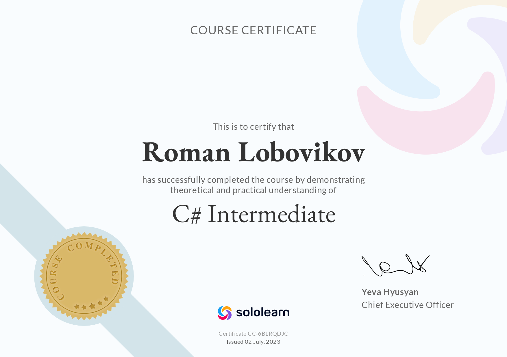

### [rsschool-cv](rsccool-cv)


#  Roman Lobovikov
#### Junior Frontend Developer
---
## Contact Info

* **Location:** Russia, Izhevsk
* **E-mail:** [camomile.one@gmail.com](camomile.one@gmail.com)
* **GitHub:** [camomileOne](https://github.com/camomileOne/)
* [Telegram](https://t.me/IZH_Roman_Lobovikov)
* [LinkedIn](https://www.linkedin.com/in/roman-lobovikov-1850a327/)


## Self Introduction

I'm patient and hardworking person. I desperately want to become a Web Developer. I'm currently taking a preparatory course «JavaScript/Front-end. Stage 0» at RS School.

## Skills

* HTML, CSS
* **Programming languages:** JavaScript, Python, C, C++, C#

## Code example
This is one of simple functions I wrote:

```c
int getSumOfDivisors(int n) {
    int sum = 1;
    int i = 2;
    for (; i < n / i; i++) {
        if (n / i * i == n) {
            sum += i + n / i;
        }
    }
    if (i * i == n)
        sum += i;
    return sum;
}
```

## Experience

I've complited several Online courses (HTML, CSS, JavaScript, etc.). Here it is my C# certificate:


[](https://api2.sololearn.com/v2/certificates/CC-6BLRQDJC/image/png)

## Education

Bachelor of **Software Engineering** in Izhevsk State Technical University

## Languages

- Russian - native
- English - Intermediate (CEFR B1)
